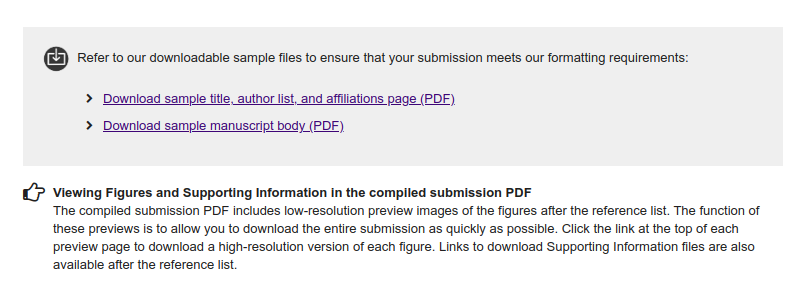

# This is the article title
\
\
John Doe^1¶^, Antonie Data^1¶^, Johannes van Stats^1,#a^, MarieTestperson^2\*^,
David Ribosome Jr.^3,4^, Gregory H.T. McBio^5,#b^, Angela Reviewerson^1,2&^, Marina
Measure^1&^, on behalf of The Bunny Genome Sequencing Consortium^\^^
\
\
^1^ {{inst-ex}}  
^2^ {{inst-dermato}}  
^3^ {{inst-libraries}}  
^4^ {{inst-restoration}}  
^5^ {{inst-restoration}} 
\
\
^#a^Current Address: {{addr-a}}  
^#b^Current Address: {{addr-b}}
\
\
\
^\*^ Corresponding author  
E-mail: testperson@university.ed (MT)  
\
\
^¶^These authors contributed equally to this work.  
^&^These authors also contributed equally to this work.  
\
^Membership of the Bunny Genome Sequencing Consortium is provided in the Acknowledgments.

\newpage

# Abstract
Lorem ipsum dolor sit amet, consectetur adipiscing elit, sed do eiusmod tempor
incididunt ut labore et dolore magna aliqua. Ut enim ad minim veniam, quis
nostrud exercitation ullamco laboris nisi ut aliquip ex ea commodo consequat.
Duis aute irure dolor in reprehenderit in voluptate velit esse cillum dolore eu
fugiat nulla pariatur. Excepteur sint occaecat cupidatat non proident, sunt in
culpa qui officia deserunt mollit anim id est laborum.
Lorem  ipsum  dolor  sit  amet,  consectetur  adipiscing  elit. 

Vestibulum adipiscing urna ut lectus gravida, vitae blandit tortor 
interdum. Donec tincidunt porta sem nec hendrerit. Vestibulum nec 
pharetra quam, vitae convallis nunc. Mauris in mattis sapien. Fusce 
sodales vulputate auctor. Nam lacus felis, fermentum sit amet nulla 
ac,  tristique  ultrices  tellus.  Integer  rutrum  aliquet  sapien,  eu 
fermentum magna pellentesque vitae. Integer semper viverra mauris 
vel pulvinar. Suspendisse sagittis malesuada urna. Praesent mauris 
diam, fringilla id fringilla ac, posuere non lorem. Vestibulum mauris 
ante, fringilla quis tortor sit amet, accumsan fermentum quam. Nulla 
dictum consectetur leo. Ut vulputate ipsum purus, a interdum nibh 
viverra et. Praesent aliquam sapien vel massa sodales bibendum.
Nulla  interdum  accumsan  lectus,  sed  auctor  elit  accumsan  a. 
Suspendisse quis rhoncus nibh. The verum est de illic.

# Introduction  
Lorem  ipsum  dolor  sit  amet,  consectetur  adipiscing  elit. 
Vestibulum adipiscing urna ut lectus gravida, vitae blandit tortor 
interdum. Donec tincidunt porta sem nec hendrerit. Vestibulum nec 
pharetra quam, vitae convallis nunc.

# Level 1 heading  
Lorem  ipsum  dolor  sit  amet,  consectetur  adipiscing  elit. 
Vestibulum  adipiscing  urna  ut  lectus  gravida,  vitae  (@fig:plos-sub) 
interdum.  Donec tincidunt porta sem nec hendrerit. Vestibulum nec 
pharetra quam, vitae convallis nunc. Mauris in mattis sapien. Fusce 
sodales vulputate auctor. Nam sit amet nulla lacus  a, Figs 1 and 2 
ultrices tellus. Integer rutrum aliquet sapien, eu fermentum magna pellentesque vitae.

{tag="B.1"}

This is a Fig 1. Lorem  ipsum  dolor  sit  amet,  consectetur  adipiscing  elit. 
Vestibulum adipiscing urna ut lectus gravida, vitae blandit tortor interdum. 
Donec $p^2$ et $q^2$ tincidunt porta sem nec hendrerit. 

<!-- comment way: Additional figure for figure numbering -->

{width=600px}


PLOS ONE's template file is located in the above (Fig 2),
The original sentencies are as follows.


```table
---
alignment: CCC
table-width: 1/1
markdown: true
---
&nbsp;, $p^2+2pq+q^2$,\(1\) 
```

From the equation. Vestibulum nec pharetra quam, vitae convallis nunc. Mauris 
in mattis sapien. Fusce sodales  vulputate auctor. Nam lacus felis, 
fermentum sit amet nulla ac, tristique ultrices tellus. Integer rutrum 
aliquet  sapien,  eu  fermentum  magna  pellentesque  vitae.  Integer
semper viverra mauris vel pulvinar dolor sit amet en $(p+q)^2 = 1$.

## Level2 heading

Lorem  ipsum  dolor  sit  amet,  consectetur  adipiscing  elit. 
Vestibulum adipiscing urna ut lectus gravida, vitae blandit tortor 
interdum.

### Level3 heading

Lorem  ipsum  dolor  sit  amet,  consectetur  adipiscing  elit.
Vestibulum adipiscing urna ut lectus gravida, vitae blandit tortor interdum.

# Level1 heading
Lorem  ipsum  dolor  sit  amet,  consectetur  adipiscing  elit.
Vestibulum  adipiscing  urna  ut  lectus  gravida,  et  bland  Table  1
Donec tincidunt porta sem nec hendrerit. Vestibulum nec pharetraquam, vitae convalli. Fido nemo.

::: {custom-style="Table Caption"}
**{{tab1-title}}**
:::
```table
---
include: Table1.csv
markdown: true
table-width: 5/5
alignment: LLLLL
---

```
::: {custom-style="Table footer"}
{{tab1-legend}}  
^a^Table footnotes belong here.  
^b^Footnotes should have corresponding symbols in the table.
:::


# Conclusion
Lorem ipsum dolor sit amet, consectetur adipiscing. 
Vestibulum adipiscing urna ut lectus gravida, vitae blandit tortor interdum.
Donec tincidunt porta sem nec hendrerit. Vestibulum nec pharetra quam, vitae convallis nunc.

# Acknowledgements
Lorem  ipsum  dolor  sit  amet,  consectetur  adipiscing  elit.
Vestibulum adipiscing urna ut lectus gravida, vitae blandit tortor interdum.


